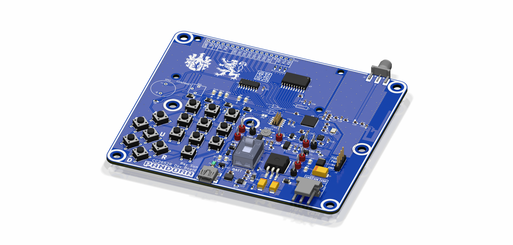
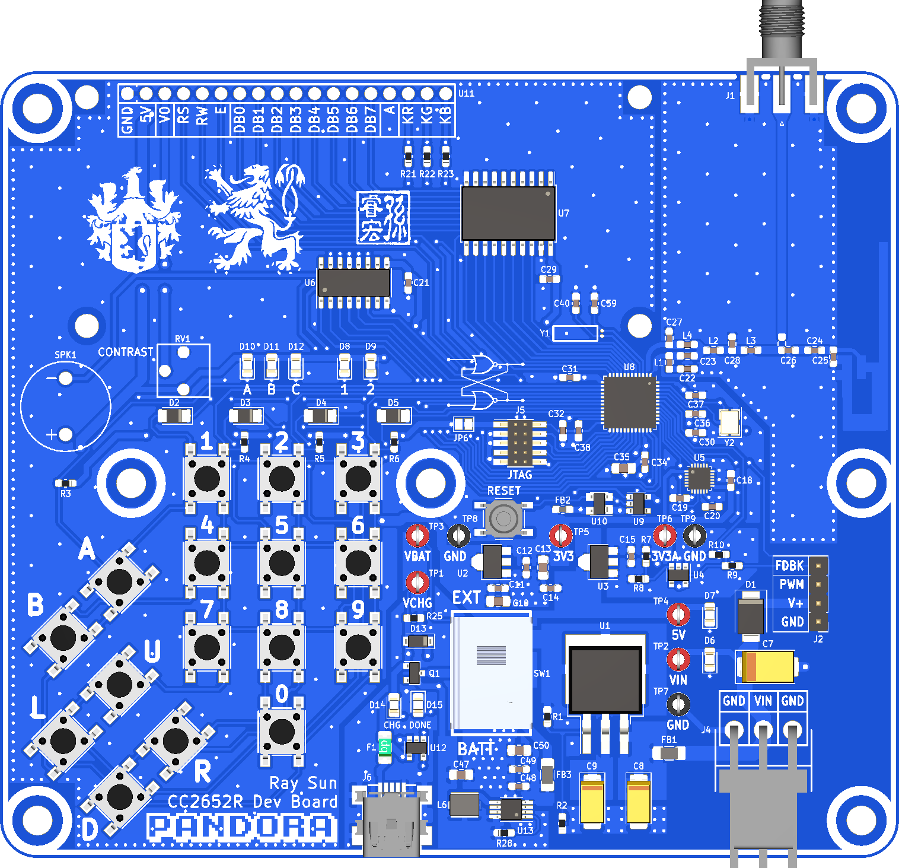
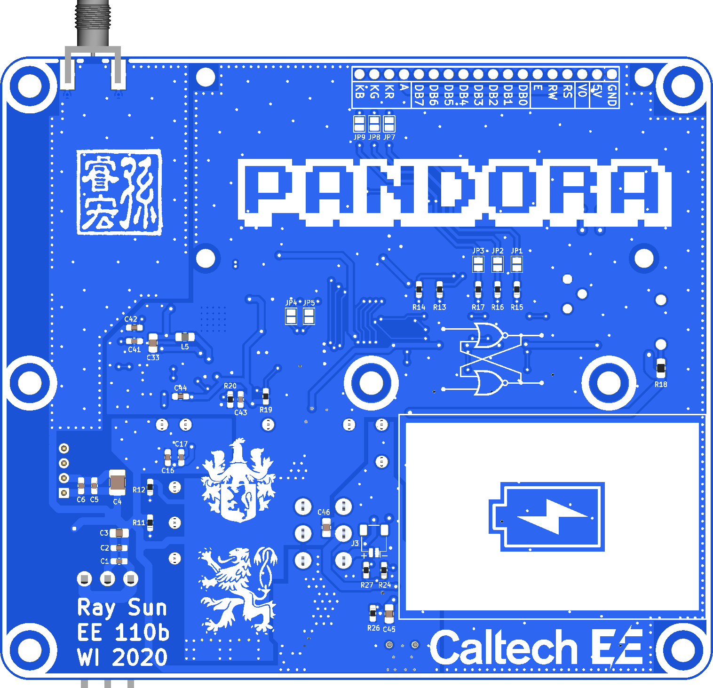

  

TI SimpleLink CC2652R mesh network embedded system development board

## Description
Pandora is a development board for the TI SimpleLink CC2652R multiprotocol dual-core ARM wireless MCU designed for the Embedded System Design Laboratory course at Caltech (EE 110b). The board features interfaces for connecting a servo and a [16x2 RGB-backlit LCD](https://www.adafruit.com/product/399). An onboard 16-key keypad and MPU-9250 IMU are provided for development use.

Pandora is intended to be powered from either an external 6-8.2V supply or a single-cell 3.7V LiPo battery. The former must be used to power the servo. A slide switch is used to select the power source. An onboard LiPo charger is present for charging through the USB-mini jack.

A TI SWRU120D 2.4GHz inverted-F PCB antenna is provided, in addition to a SMA jack for connecting an external 2.4GHz antenna. The antenna is selected using an 0603 two-way jumper.

This PCB is designed with KiCad v.5.1.5. Documentation may be found under `/doc`, and Gerbers under `/gerber`. 

## Author
- Ray Sun - Undergraduate, Electrical Engineering, Caltech, Class of 2020

## Licensing
This project is released under the terms of the MIT License.
